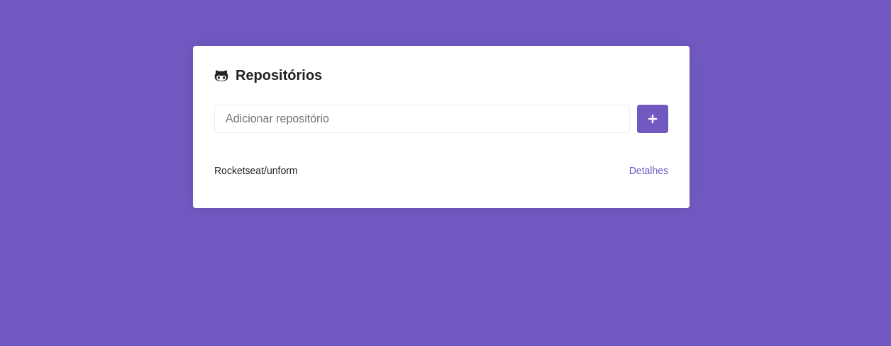
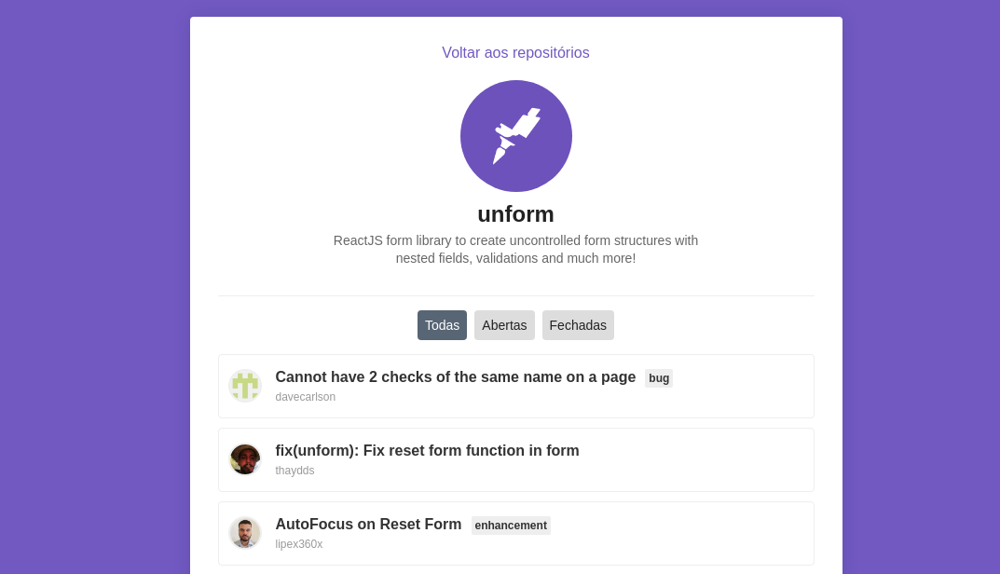

## módulo05 do bootcamp - Rocketseat

[Live Preview](<[server](https://github.com/walefe/bootcamp-rocketseat-modulo05.git)>)

 

  
  
  

 

  

## Features

This app features all the latest tools and practices in web development!

- ⚛ **React** — A library to build user interfaces
- **React-Routes** - A popular library for router.
- **React-Icons** - Popular icons
- 💅 **CSS** — styled-components
- 💖 **Lint** — ESlint/Prettier/Editor Config

## Getting started

1. Clone this repo using `https://github.com/walefe/bootcamp-rocketseat-modulo05.git`
2. Move to the appropriate directory: `cd bootcamp-rocketseat-modulo05`. 
3. Run `yarn` to install dependencies. 
4. Run `yarn start` to see the example app at `http://localhost:3000`.
